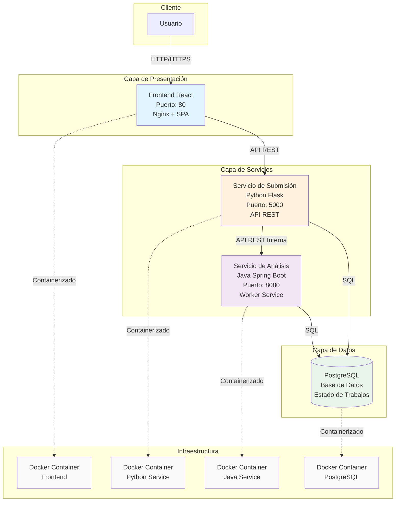
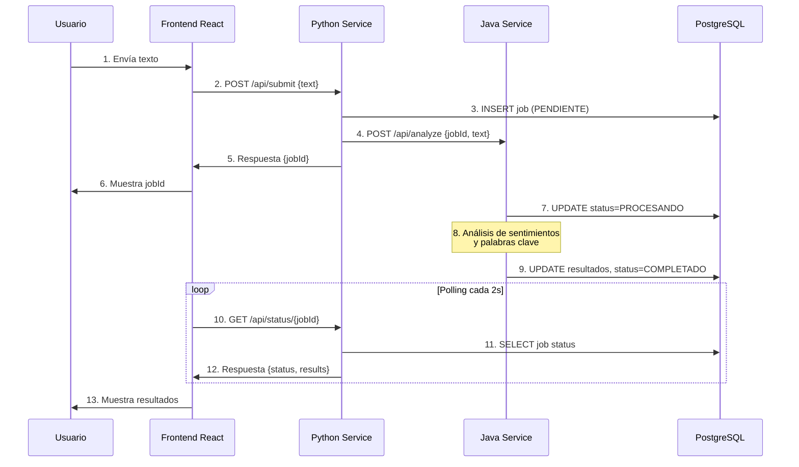

# Diagrama de Componentes - AnalytiCore

## Flujo de Datos

## Tecnologías por Componente

| Componente | Tecnología Principal | Puerto | Responsabilidad |
|------------|---------------------|---------|-----------------|
| Frontend | React 18 + Nginx | 80 | Interfaz de usuario |
| Python Service | Flask + Gunicorn | 5000 | API Gateway, Orquestación |
| Java Service | Spring Boot 3 | 8080 | Procesamiento de análisis |
| Base de Datos | PostgreSQL 15 | 5432 | Persistencia de estado |
