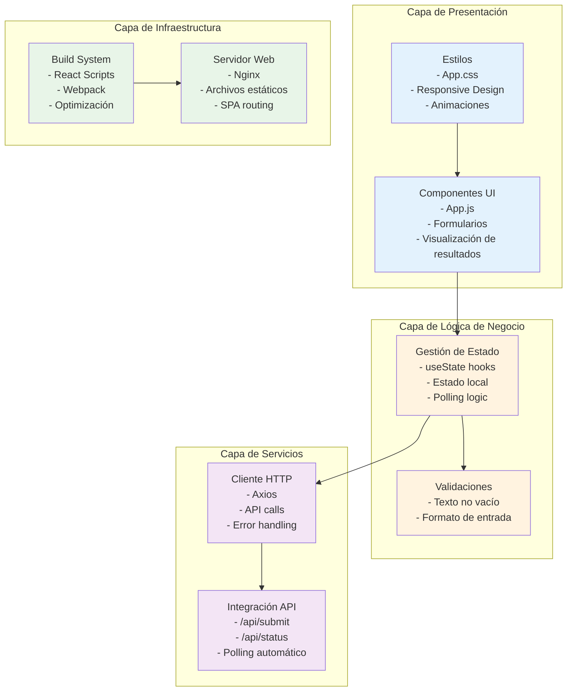
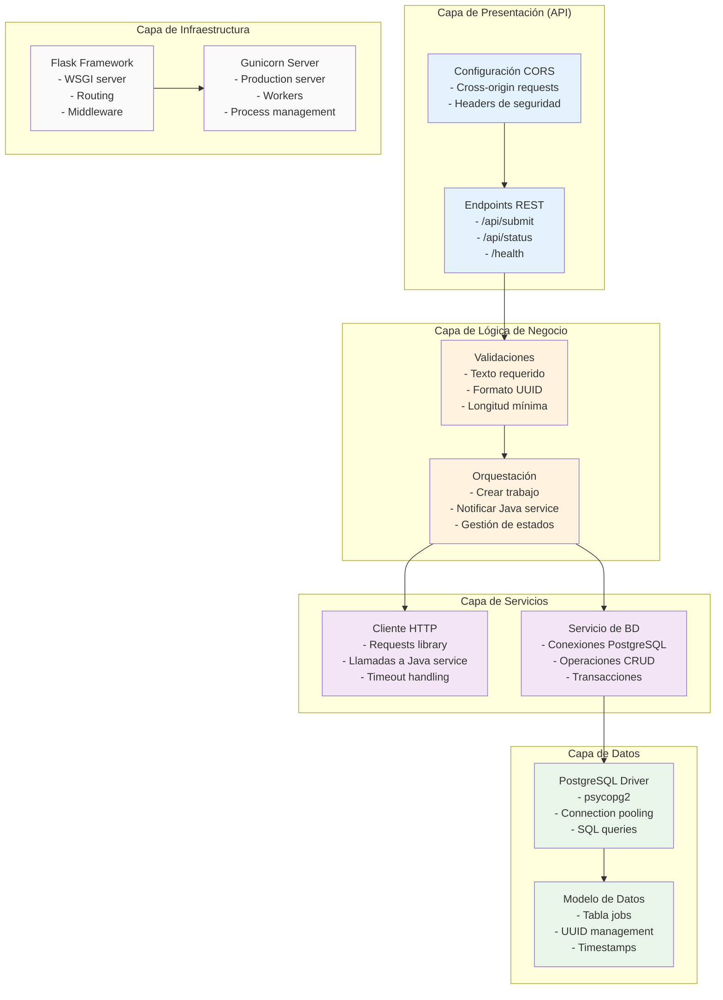
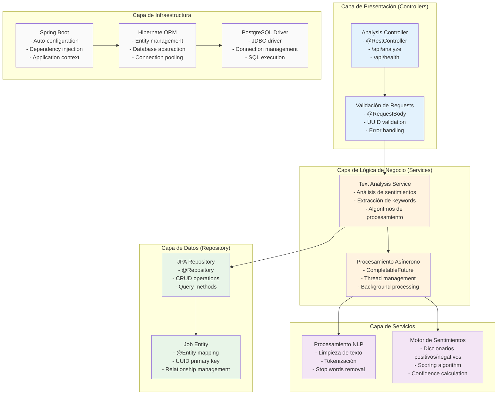

# Diagramas de Capas por Componente

## 1. Frontend React - Arquitectura por Capas

## 2. Python Service - Arquitectura por Capas

## 3. Java Service - Arquitectura por Capas

## Separación de Responsabilidades

### Frontend React
- **Presentación**: Renderizado de UI y manejo de eventos
- **Estado**: Gestión de estado local y comunicación con APIs
- **Validación**: Validaciones del lado cliente
- **Infraestructura**: Optimización y servido de archivos estáticos

### Python Service (API Gateway)
- **Orquestación**: Coordinación entre frontend y servicios backend
- **Validación**: Validaciones de negocio y formato
- **Persistencia**: Gestión de estado de trabajos
- **Comunicación**: Interface con servicios externos

### Java Service (Worker)
- **Procesamiento**: Análisis intensivo de texto
- **Algoritmos**: Implementación de lógica de NLP
- **Persistencia**: Actualización de resultados
- **Concurrencia**: Manejo de múltiples trabajos simultáneos

Esta arquitectura en capas asegura:
- **Bajo acoplamiento** entre componentes
- **Alta cohesión** dentro de cada capa  
- **Testabilidad** independiente de cada capa
- **Mantenibilidad** y evolución controlada
- **Escalabilidad** horizontal por servicio
